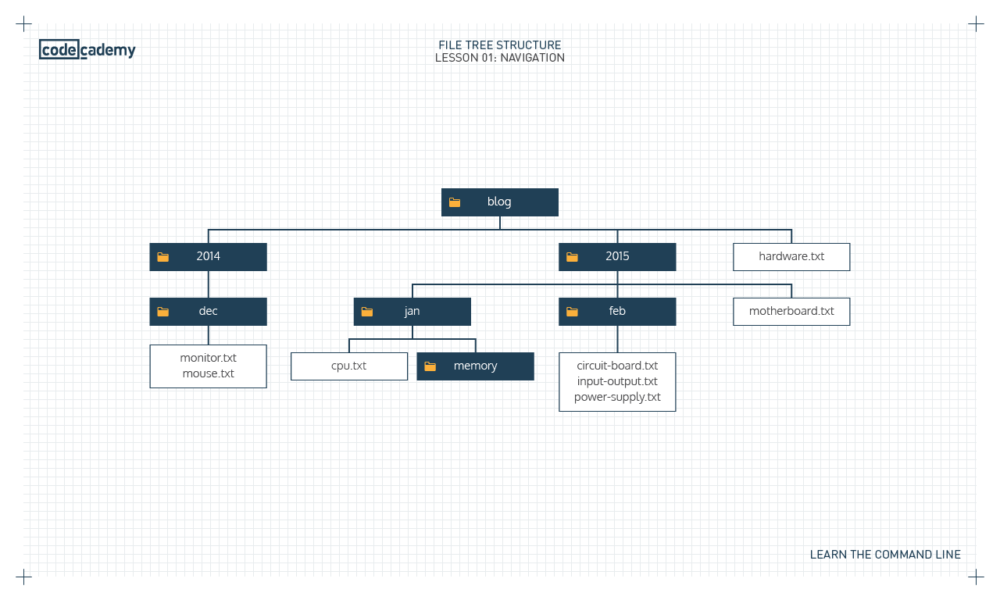

# Command line

- command line คือ text interface สำหรับ computer’s operating system.
- ใช้ command line ผ่าน terminal

## Navigation

- directory ก็คือ folder



- $ เรียกว่า shell prompt

### ls

- show folder กับ file ทั้งหมดที่อยู่ใน current folder ที่เราอยู่ตอนนี้

```
$ ls

2014  2015  hardware.txt  keyboard.txt
```

### pwd

- show path ของ current folder ที่เราอยู่ตอนนี้
- pwd ย่อมาจาก "print working directory"

```
$ pwd

/home/ccuser/workspace/blog
```

### cd

- เปลี่ยน folder
- cd ย่อมาจาก change directory
- cd `argument` (argument คือ folder,relative path,absolute path)
- cd .. คือการ move up ขึ้นมา 1 directory
- Example cd move up to 1 directory

  ```
  $ pwd
  /home/ccuser/workspace/blog/2015
  $ cd ..
  $ pwd
  /home/ccuser/workspace/blog
  ```

- Example cd into 1 folder

  ```
  $ pwd
  /home/ccuser/workspace/blog
  $ cd 2015
  $ pwd
  /home/ccuser/workspace/blog/2015
  ```

- Example cd relative path

  ```
  $ pwd
  /home/ccuser/workspace/blog
  $ cd 2015/jan/memory
  $ pwd
  /home/ccuser/workspace/blog/2015/jan/memory
  ```

- Example cd move up multiple directory

  ```
  $ pwd
  /home/ccuser/workspace/blog/2015/jan/memory
  $ cd ../..
  $ pwd
  /home/ccuser/workspace/blog/2015
  ```

- Example cd move up and then move to folder

  ```
  $ ls
  2014  2015  hardware.txt
  $ cd 2015
  $ pwd
  /home/ccuser/workspace/blog/2015
  $ cd ../2014
  $ pwd
  /home/ccuser/workspace/blog/2014
  ```

### mkdir

- สร้าง folder ใน current directory ที่อยู่ตอนนี้
- mkdir ย่อมาจาก make directory
- mkdir argument (argument เป็นชื่อ folder,relative path)
- Example สร้าง folder ธรรมดา
  ```
  $ mkdir media
  ```
- Example สร้าง folder ด้วย relative path

  ```
  $ pwd
  /home/ccuser/workspace/blog/2014/dec
  $ ls
  media  media2  monitor.txt  mouse.txt
  $ mkdir media2/tv
  $ cd media2
  $ ls
  tv
  ```

### touch

- create new file ใน current directory

```
$ touch keyboard.txt
```

### Helper Commands

- เวลาเราพิมพ์ชื่อ folder,file แล้วกด tab มันจะ auto complete ชื่อของ folder หรือ file ที่มีอยู่ให้ (`จะเป็นชื่อ folder,file ที่อยู่ใน current directory นี้เท่านั้น`)
- กด up, down arrows (↑ and ↓) เพื่อดู command cycle history ที่เราเคยใช้
  - up arrow => เลื่อน command ก่อนหน้ากลับไปเรื่อยๆจนเก่าสุด
  - down arrow => เลื่อน command ลงมาเรื่อยๆจนล่าสุด
- clear คือเคลียร์ display command ทั้งหมดที่เราเคยใช้ (clear แค่ display แต่ไม่ได้ clear สิ่งที่ command เคยทำ)
